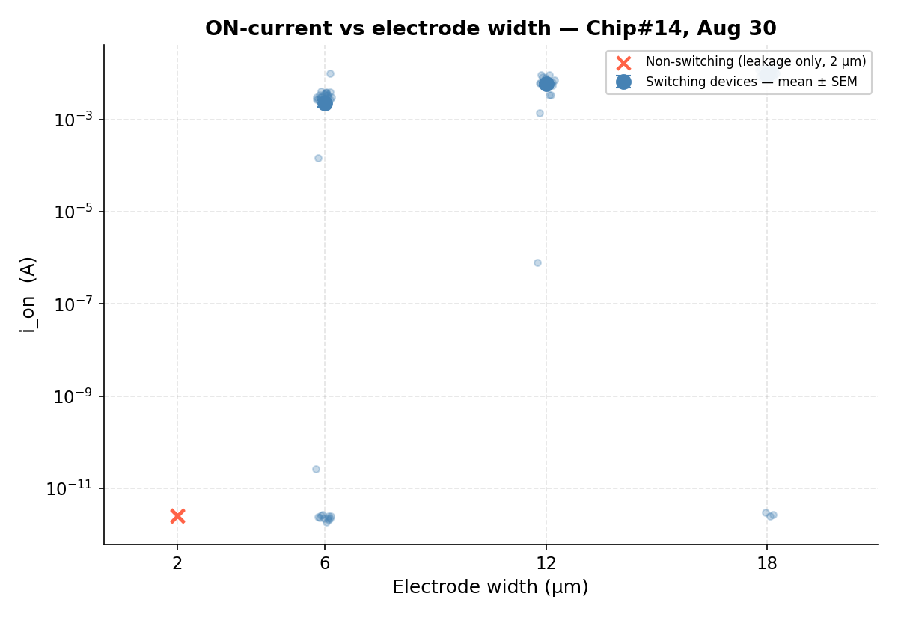
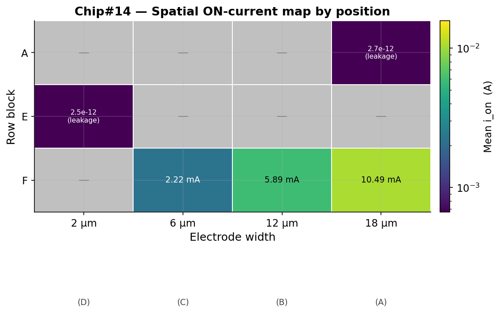

# MoS₂ Memristor ML Analysis

ML analysis of printed MoS₂/Graphene memristors —
feature extraction, electroforming kinetics, electrode
geometry study. Real Keithley 2634B data from Imperial
College London (Torrisi Lab, 2024).

## Key Results

### Electroforming Effect — ON-state Current vs Run Number

> ON-state current increases with cycling (R²=0.48, p<0.001),
confirming progressive conductive filament formation.

### Electrode Width → Switching Performance

> ON current scales monotonically with electrode width.
2μm devices show only leakage current — never switched.

### Chip-level Spatial Map

> Spatial ON-current map by row/electrode position.
No positional clustering — geometry dominates over location.

### Chip-to-Chip Comparison

> Chip#14 shows widest dynamic range. Chip#6 stuck in
OFF state — incomplete electroforming.

## Findings Summary

| Analysis | Result |
|---|---|
| Layer count vs on/off ratio | r < 0.25 — no predictive relationship |
| Random Forest (layer count) | R² = −0.09 — insufficient predictor |
| Electroforming (Chip#14) | R² = 0.48, p<0.001 — confirmed |
| Electrode width sweep | ON current spans 6 decades: 2→18μm |
| Minimum reliable width | 12μm — 6μm marginal, 2μm no switching |

## Notebooks

| Notebook | What it does |
|---|---|
| 01_eda | Layer distribution, IV curve visualisation |
| 02_random_forest | ML prediction from layer count |
| 03_stability_analysis | Electroforming kinetics, Chip#14 |
| 04_electrode_width | Contact geometry → switching performance |

## Data Pipeline

Raw Keithley 2634B CSVs (577 files, 85 Chip#14 runs)
↓
Feature extraction: v_set, v_reset, i_on, i_off per sweep
↓
data/processed/ — cleaned feature tables (read-only)
↓
data/derived/  — position-parsed, enriched tables
↓
notebooks/     — analysis and visualisation

## Author

Won Jun Lee (이원준) · MRes Soft Electronics ·
Imperial College London ·
[github.com/wjlee619](https://github.com/wjlee619)
