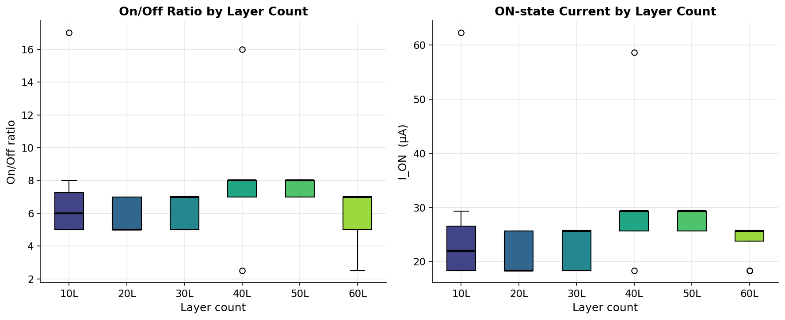
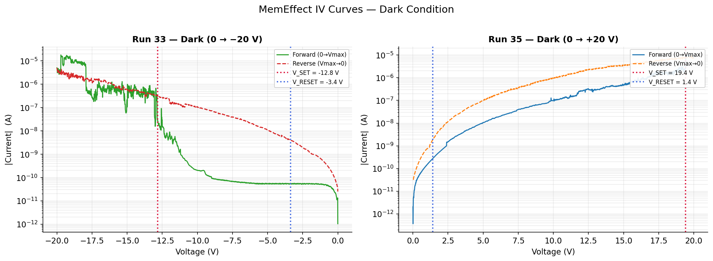
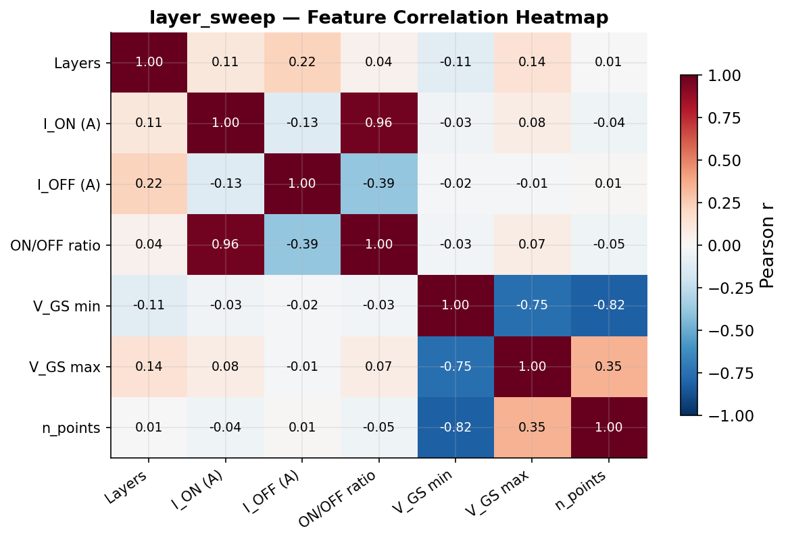
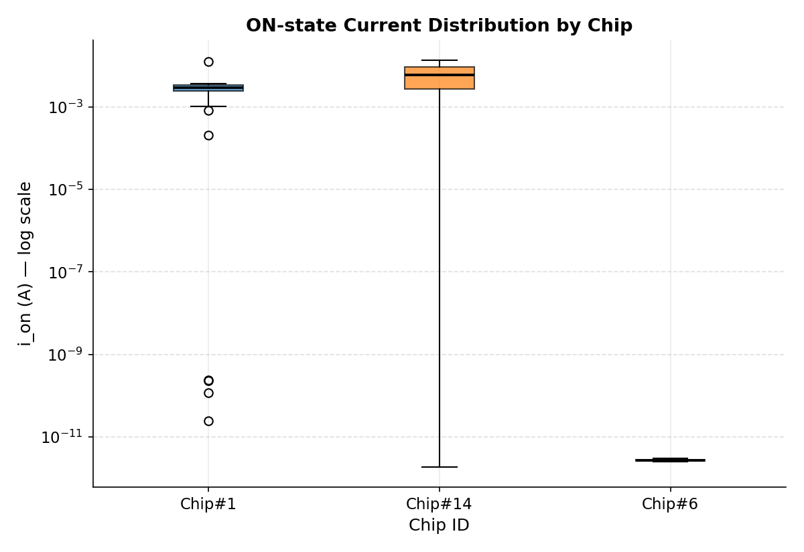
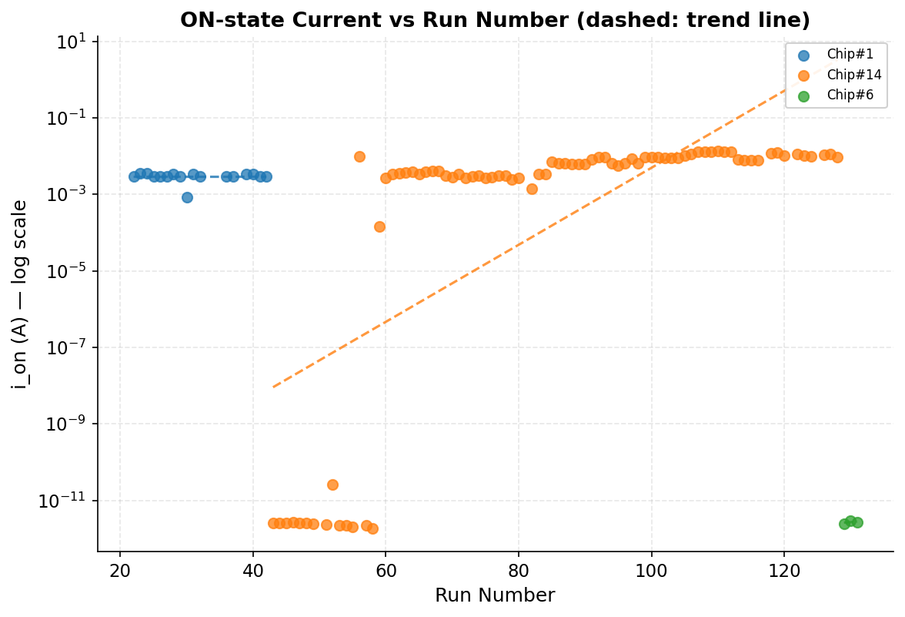
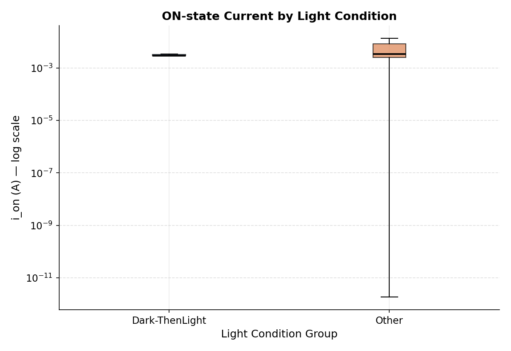

# MoS₂ Memristor ML Analysis

> Machine learning analysis of MoS₂/Graphene printed memristor devices — feature extraction, EDA, and ON-state stability study.

**Imperial College London MRes Research Project**
*Won Jun Lee (이원준) · 2024–2025*

---

## What This Project Does

This project takes raw electrical measurement data from MoS₂-based memristor devices and turns it into machine learning-ready features. The goal was to find out whether **layer count** and **measurement conditions** can predict device performance.

**Short answer:** Layer count alone cannot predict switching performance. But repeated measurements reveal a clear **electroforming effect** — devices get better the more you use them.

---

## Results at a Glance

| Analysis | Key Finding |
|----------|-------------|
| Layer count vs on/off ratio | r < 0.25 — no linear relationship |
| Random Forest prediction | R² = –0.09 — layer count insufficient for prediction |
| ON-state stability (Chip#14) | R² = 0.48, p < 0.001 — electroforming confirmed |
| Light vs Dark conditions | p = 0.25 — no significant effect on ON-state current |

---

## Device Background

These devices are **bipolar memristors** — they can switch in both positive and negative voltage directions.

| Property | Run 33 (–20V) | Run 35 (+20V) |
|----------|---------------|---------------|
| SET voltage | –12.83 V | +19.41 V |
| RESET voltage | –3.36 V | +1.42 V |
| ON current | 16 μA | 9.5 μA |
| OFF current | ~1 pA | ~0.4 pA |
| ON/OFF ratio | ~1.5 × 10⁷ | ~2.6 × 10⁷ |
| Hysteresis window | 9.46 V | 17.99 V |

---

## Project Structure

```
mos2-memristor-ml/
│
├── data/
│   └── processed/
│       ├── layer_sweep.csv          # Phase 1: gate sweep features (73 files)
│       ├── memeffect_sweep.csv      # Phase 1b: IV sweep features (39 files)
│       └── memeffect_sweep_aug30.csv # Phase 1c: Aug 2024 batch (85 files)
│
├── notebooks/
│   ├── 01_eda.ipynb                 # Exploratory Data Analysis
│   ├── 02_random_forest.ipynb       # Random Forest ML
│   └── 03_stability_analysis.ipynb  # ON-state stability study
│
├── scripts/
│   ├── process_layer_sweep.py       # Phase 1 extraction
│   ├── extract_memeffect_iv.py      # Phase 1b extraction (SET/RESET detection)
│   ├── build_eda_notebook.py        # Phase 2 notebook builder
│   ├── build_rf_notebook.py         # Phase 3a notebook builder
│   └── build_stability_notebook.py  # Phase 3b notebook builder
│
├── results/
│   └── figures/
│       ├── fig_s1_layer_distribution.png
│       ├── fig_s2_iv_curves.png
│       ├── fig_s3_correlation.png
│       ├── fig_s4_data_quality.png
│       ├── 03_chip_ion_boxplot.png
│       ├── 03_run_ion_trend.png
│       └── 03_lightcond_ion_boxplot.png
│
└── docs/
    └── mos2_project_notes.md        # Full learning notes with reasoning
```

---

## Pipeline Overview

```
Raw CSV files (Keithley 2634B measurements)
          │
          ▼
┌─────────────────────────────────────────┐
│  Phase 1: Gate Sweep Extraction         │
│  73 files → layer_sweep.csv             │
│  Features: id_on, id_off, on/off ratio  │
└─────────────────────────────────────────┘
          │
          ▼
┌─────────────────────────────────────────┐
│  Phase 1b: IV Sweep Extraction          │
│  39 files → memeffect_sweep.csv         │
│  Algorithm: d(log|I|)/dV for SET/RESET  │
└─────────────────────────────────────────┘
          │
          ▼
┌─────────────────────────────────────────┐
│  Phase 2: EDA                           │
│  Distribution, correlation, quality     │
│  Key finding: Spurious correlation      │
│  i_on ↔ on/off ratio (r=0.96, noise    │
│  floor artifact)                        │
└─────────────────────────────────────────┘
          │
          ▼
┌─────────────────────────────────────────┐
│  Phase 3a: Random Forest                │
│  Target: on/off ratio                   │
│  Result: R²=–0.09 (layer count fails)  │
└─────────────────────────────────────────┘
          │
          ▼
┌─────────────────────────────────────────┐
│  Phase 3b: Stability Analysis           │
│  115 already_on samples                 │
│  Electroforming: R²=0.48, p<0.001      │
└─────────────────────────────────────────┘
```

---

## Key Figures

### Layer Distribution & ON/OFF Ratio

> Boxplot of on/off ratio across 6 layer groups (10–60 layers). No clear monotonic trend — layer count alone does not predict switching performance.

### IV Curves — SET and RESET Detection

> Log-scale IV curves for Run 33 (negative voltage) and Run 35 (positive voltage). SET and RESET voltages marked. Classic bipolar memristive hysteresis visible in Run 35.

### Correlation Heatmap

> Feature correlation matrix for layer_sweep data. Strong i_on ↔ on/off ratio correlation (r=0.96) is a noise floor artifact, not a physical relationship.

### Chip-level ON-state Current Distribution

> ON-state current distribution by chip batch. Chip#14 (mA range) and Chip#1 (mA range) both show stable ON states. Chip#6 (pA range) indicates incomplete SET.

### Electroforming Effect

> ON-state current vs run number for Chip#14. Significant upward trend (R²=0.48, p<0.001) consistent with progressive conductive filament formation (electroforming).

### Light Condition Comparison

> ON-state current under Dark vs Dark-ThenLight conditions. No significant difference (Mann-Whitney U, p=0.25) — stable ON state is insensitive to illumination.

---

## Core Algorithm — SET/RESET Detection

The key challenge: OFF current (~10⁻¹² A) and ON current (~10⁻⁵ A) differ by **10 million times**. A simple dI/dV approach gets swamped by noise near the ON state.

**Solution: d(log₁₀|I|)/dV**

```python
# Convert current to log scale — compresses 10⁷ range to 7 decades
log_i = np.log10(np.abs(current))

# Calculate slope per volt
grad_idx = np.gradient(log_i)
dv = np.gradient(np.abs(voltage))
grad_v = grad_idx / np.abs(dv)          # units: decades/V

# Smooth to remove noise (20-point moving average)
kernel = np.ones(20) / 20
grad_smooth = np.convolve(grad_v, kernel, mode='same')

# SET = steepest positive slope
# RESET = steepest negative slope
set_idx   = np.argmax(grad_smooth)
reset_idx = np.argmin(grad_smooth)
```

---

---

## Data Description

### layer_sweep.csv
| Column | Description |
|--------|-------------|
| `layers` | Number of MoS₂ layers (10, 20, 30, 40, 50, 60) |
| `id_on_A` | ON-state drain current (A) |
| `id_off_A` | OFF-state drain current (A) — note: noise floor at ~3.66×10⁻⁶ A |
| `on_off_ratio` | id_on / id_off |
| `vgs_min_V` | Gate sweep minimum voltage (V) |
| `vgs_max_V` | Gate sweep maximum voltage (V) |

### memeffect_sweep.csv
| Column | Description |
|--------|-------------|
| `switching_state` | `switched` / `already_on` / `low_voltage_sweep` |
| `v_set_V` | SET voltage (V) |
| `v_reset_V` | RESET voltage (V) |
| `i_on_A` | ON-state current (A) |
| `i_off_A` | OFF-state current (A) |
| `on_off_ratio` | i_on / i_off |
| `hysteresis_window_V` | \|v_set – v_reset\| (V) |

---

## Background

MoS₂ (molybdenum disulfide) is a 2D transition metal dichalcogenide semiconductor. When incorporated into a printed memristor device with graphene electrodes, it shows resistive switching behaviour suitable for neuromorphic computing applications.

This dataset was collected during MRes research at **Imperial College London (2024)** in the **2DWeb group, Felice Torrisi Lab** (MSRH building), using a Keithley 2634B SourceMeter. Measurements were conducted in collaboration with PhD researcher **Shanglong (2024)**.

---

## Author

**Won Jun Lee (이원준)**
MRes Soft Electronics, Imperial College London
[github.com/wjlee619](https://github.com/wjlee619)

---

## License

MIT License — see `LICENSE` for details.
